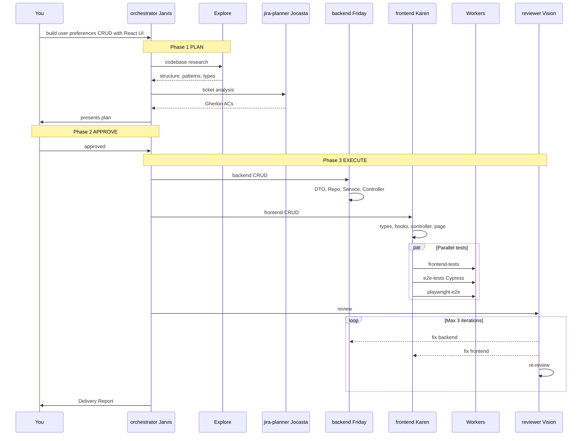
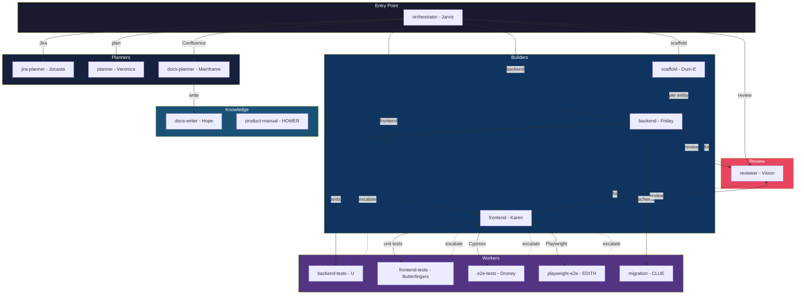

# Awesome Skills Copilot — Architecture Guide v4.0.0

> **15 specialized AI agents** orchestrated as a team. One entry point: `@orchestrator`. Mandatory quality gates enforce tests, review, and migrations automatically — you never have to ask. Everything runs locally in your VS Code.

---

## Quick Start (30 seconds)

```
# 1. Plan and build a feature from a Jira ticket (plan → approve → implement)
@orchestrator plan PROJ-1234

# 2. Build anything — agent auto-detects frontend/backend/full-stack
@orchestrator build user preferences CRUD with React UI

# 3. Enrich plan with Confluence knowledge
@docs-planner plan PROJ-1234 with Confluence context

# 4. Write documentation to Confluence
@docs-writer create Frontend Standards page in NG space

# 5. That's it. Tests, review, and migrations happen automatically.
```

> **🖥️ Everything runs locally** — All agents execute inside your VS Code Copilot Chat. Sub-agent delegation uses `runSubagent` (visible in chat). No background processes, no cloud agents, no terminal-only sessions. You see every step.

**What happens behind the scenes:**



---

## Architecture



### Agent Roster (15 agents)

| Codename | Agent | Role | Model |
|----------|-------|------|-------|
| **Jarvis** | `@orchestrator` | Single entry point — plan → approve → execute | Sonnet 4.6 |
| **Veronica** | `@planner` | Read-only planning with Gherkin ACs, risks, estimates | Sonnet 4.6 |
| **Jocasta** | `@jira-planner` | Jira read+write — Gherkin conversion, DoD checklists | Sonnet 4.6 |
| **Mainframe** | `@docs-planner` | Jira + Confluence bridge planner | Sonnet 4.6 |
| **Friday** | `@backend` | .NET 10 CRUD code generator | Sonnet 4.6 |
| **Karen** | `@frontend` | React 19 + TypeScript + MUI 7 builder | Sonnet 4.6 |
| **Dum-E** | `@scaffold` | .NET 10 microservice skeleton scaffolder | Sonnet 4.6 |
| **Vision** | `@reviewer` | Multi-model panel review (7 dimensions, auto-fix loop) | Sonnet 4.6 |
| **Hope** | `@docs-writer` | Confluence documentation writer | Sonnet 4.5 |
| **H.O.M.E.R.** | `@product-manual` | HTML product documentation generator | Sonnet 4.6 |
| **U** | `@backend-tests` | NUnit + Moq backend tests (≥95% coverage) | Sonnet 4.5 |
| **Butterfingers** | `@frontend-tests` | Vitest + RTL frontend tests (≥90% coverage) | Sonnet 4.5 |
| **Droney** | `@e2e-tests` | Cypress E2E with strict POM | Sonnet 4.5 |
| **E.D.I.T.H.** | `@playwright-e2e` | Playwright E2E — cross-browser, a11y audits | Sonnet 4.5 |
| **C.L.U.E.** | `@migration` | EF Core migrations — rollback-safe Up/Down | Sonnet 4.5 |

---

## Mandatory Quality Chains (§ 12)

**These are non-negotiable. Every code generation triggers the appropriate chain automatically.**

### Backend Chain

```
@backend
      │
      ├── 1. Generate all layers (DTO → Controller → Startup)
      ├── 2. dotnet build — must pass
      ├── 3. @migration — auto if new entity or schema change
      ├── 4. @backend-tests — happy + error paths for every CRUD op
      └── 5. @reviewer --full — must score ≤ 5
              └── if score > 5 → auto-fix → re-review (max 3 iterations)
```

### Frontend Chain

```
@frontend
      │
      ├── 1. Generate components, hooks, queries, types
      ├── 2. npm run build + npm run lint — 0 errors
      ├── 3. PARALLEL:
      │     ├── @frontend-tests — ≥90% coverage (major features + branches), behavior assertions
      │     ├── @e2e-tests — strict POM, no raw cy.get()
      │     └── @playwright-e2e — E.D.I.T.H. cross-browser POM, a11y audits
      └── 4. @reviewer --full — must score ≤ 5
              └── if score > 5 → auto-fix → re-review (max 3 iterations)
```

### Full-Stack Chain

```
Backend chain (above) → Frontend chain (above) → Cross-contract verification
```

After both complete, the orchestrator verifies:
- API response shapes match frontend TypeScript types
- Query/mutation hook params align with controller endpoints
- E2E tests exercise the full integration path

### Skip Override

The **only** way to skip a chain step is to explicitly say it:
```
@orchestrator build user preferences — skip tests
@orchestrator build user preferences — skip review
```
The agent logs the override in the response.

---

## Workflow Recipes

### Recipe 1: Build from Jira ticket (recommended)

```
@orchestrator plan PROJ-1234
```
→ Reviews plan → Approve → Implementation starts automatically

### Recipe 2: Quick build (skip planning phase)

```
@orchestrator build CRUD for UserPreferences with React form
```

### Recipe 3: Backend only (via orchestrator)

```
@orchestrator build CRUD for UserPreferences entity — backend only
```
→ Routes to `@backend` → migration check → tests → review

### Recipe 4: Frontend only (via orchestrator)

```
@orchestrator convert StorageAreas.tsx to Org platform patterns — frontend only
```
→ Routes to `@frontend` → unit tests + E2E (parallel) → review

### Recipe 5: Review existing code

```
@code-reviewer --full src/domain/user-preferences/
```

### Recipe 6: Direct Jira ticket parsing

```
@jira-planner plan PROJ-1234
```
→ Gets Gherkin ACs, structured TODOs, T-shirt estimates

### Recipe 7: Enrich plan with Confluence knowledge

```
@docs-planner plan PROJ-1234 with Confluence context
```
→ Searches Confluence for standards, ADRs, system design → enriched plan with citations

### Recipe 8: Write documentation to Confluence

```
@docs-writer create Frontend Standards page in NG space
```
→ Searches for duplicates → previews content → creates page with labels

### Recipe 9: Scaffold a new microservice (via orchestrator)

```
@orchestrator scaffold new InventoryManagement microservice
```
→ Routes to `@scaffold` → creates .NET 10 microservice skeleton → delegates entity CRUD to `@backend` (migration + tests + review chain runs automatically)

---

## Handoff Buttons

After agents complete work, they offer **clickable handoff buttons**:

| Button | From Agent | To Agent | What it does |
|--------|-----------|----------|-------------|
| � Review All Code | `@orchestrator` | `@code-reviewer` | Full 5-dimension review |
| 🧱 Scaffold New Service | `@orchestrator` | `@scaffold` | Scaffolds new .NET 10 microservice |
| 📄 Export Plan | `@orchestrator` | (file) | Exports plan to untitled file for offline editing |
| 🔍 Review Backend Code | `@backend` | `@code-reviewer` | Backend-focused review |
| 🔍 Review Frontend Code | `@frontend` | `@code-reviewer` | Frontend-focused review |
| 🧱 Add CRUD Entity | `@scaffold` | `@backend` | Adds entity CRUD to the scaffolded service |
| 🔍 Review Scaffold | `@scaffold` | `@code-reviewer` | Reviews the generated service skeleton |
| 🔧 Fix Frontend Issues | `@code-reviewer` | `@frontend` | Routes review findings to frontend builder |
| 🔧 Fix Backend Issues | `@code-reviewer` | `@backend` | Routes review findings to backend builder |

---

## Quality Thresholds

Default thresholds (overridable per-project in `copilot-instructions.md`):

| Threshold | Default | Purpose |
|-----------|---------|---------|
| `REVIEW_PASS_THRESHOLD` | 5 | Review score must be ≤ this to pass |
| `FRONTEND_COVERAGE_MIN` | 90% | Minimum unit test coverage (major features + branches) |
| `BACKEND_COVERAGE_MIN` | 95% | Minimum CRUD path coverage (persona-centric) |
| `MAX_REVIEW_ITERATIONS` | 3 | Auto-fix loop limit before escalating to user |
| `CYPRESS_MANDATORY` | true | Whether Cypress E2E tests are auto-generated |
| `PLAYWRIGHT_MANDATORY` | true | Whether Playwright E2E tests are auto-generated |
| `MIGRATION_AUTO_DETECT` | true | Whether migrations are auto-checked |

**Override for a specific project** — add to that project's `copilot-instructions.md`:
```markdown
## Quality Overrides
- REVIEW_PASS_THRESHOLD: 8
- CYPRESS_MANDATORY: false
```

---

## Shared Instruction Files (Auto-Injected)

The `` folder contains standards that are **automatically loaded** by Copilot when editing matching files. Agents reference these instead of embedding content.

> **v1.2.0 — GUARDRAILS split for ~75% token reduction.** The monolith has been replaced with 3 focused files; `GUARDRAILS.instructions.md` is now a redirect index.

| Instruction File | Auto-Applied When Editing | Content |
|-----------------|--------------------------|-------|
| `GUARDRAILS.instructions.md` | `**` (all files) | **Redirect index** — maps § 1–§ 13 to the 3 files below |
| `GUARDRAILS-core.instructions.md` | `**` (all files) | § 1 Principles · § 2 Response Format · § 3 Output Contract · § 6 Do/Don't · § 8 Decision Log · § 9 Hallucination |
| `GUARDRAILS-code.instructions.md` | `**/*.{cs,ts,tsx}` | § 4 Quality Gates · § 5 Migration Safety · § 10 Security (SEC-1–SEC-24) · § 13 Structured Logging Standard |
| `GUARDRAILS-orchestration.instructions.md` | `agents/**` | § 7 Domain rules (7a–7j) · § 11 Jira MCP · § 11b Confluence MCP · § 12 Mandatory Chains (12a–12n) · § 12n Pre-Push Gate · § 12o Performance Targets · § 12p Concurrency Limits · § 12q Chain Override Audit Log · § 12r Post-Migration Rollback |
| `testing-standards.instructions.md` | `*.test.ts`, `*.spec.ts`, `*.cy.ts`, `*Test.cs` | Forbidden anti-patterns, correct test patterns |
| `backend-patterns.instructions.md` | `*.cs`, `Controllers/**`, `Services/**` | .NET architecture, async patterns, error handling |
| `auth-patterns.instructions.md` | `Controllers/**`, `Startup.cs`, `*Auth*` | Authentication, authorization, user info |
| `filters.instructions.md` | `*Filter*`, `*RSQL*` | FiltersPanel, RSQL query building |
| `cypress-patterns.instructions.md` | `cypress/**`, `*.cy.ts` | POM templates, API mocking, test cleanup |
| `platform-mui.instructions.md` | `src/**/*` | PlatformMrt, FormDialog, theme spacing |
| `platform-common.instructions.md` | `src/**/*` | Auth, i18n, RSQL, utilities |
| `platform-dev.instructions.md` | `src/**/*` | Dev tooling, build config, linting |
| `ef-migration-patterns.instructions.md` | `Migrations/**`, `*DbContext*` | EF Core templates, naming, audit trail |

---

## Portable Agent Skills

Mandatory chains are also available as **Skills** for any agent that needs them:

| Skill | Path | Implements |
|-------|------|-----------|
| `mandatory-frontend-chain` | `skills/mandatory-frontend-chain/SKILL.md` | Frontend chain (§ 12a) |
| `mandatory-backend-chain` | `skills/mandatory-backend-chain/SKILL.md` | Backend chain (§ 12b) |
| `mandatory-review-chain` | `skills/mandatory-review-chain/SKILL.md` | Review protocol (§ 12e) |
| `confluence-content-guide` | `skills/confluence-content-guide/SKILL.md` | Confluence page templates & labeling conventions |
| `namespace-detection` | `skills/namespace-detection/SKILL.md` | Auto-detect .NET service namespace from `.csproj` and source files |
| `gherkin-format` | `skills/gherkin-format/SKILL.md` | Gherkin structure, rules G1–G11, worked examples for all Jira ticket types |

Skills travel with the repo — same quality gates everywhere.

---

## MCP Servers (Organization-Wide)

Defined in [`.vscode/mcp.json`](../.vscode/mcp.json), auto-loaded for every repo.

| MCP Server | Tools | Used By |
|------------|-------|---------|
| **jira-azure** | `mcp_jira-azure_jira_get_issue`, `mcp_jira-azure_jira_search_issues`, `mcp_jira-azure_jira_create_issue`, `mcp_jira-azure_jira_update_issue`, `mcp_jira-azure_jira_add_comment`, `mcp_jira-azure_jira_transition_issue`, `mcp_jira-azure_jira_list_transitions`, `mcp_jira-azure_jira_import_checklist_template` | `@jira-planner` (read+write), `@orchestrator` (read-only) |
| **confluence-az** | `mcp_confluence-az_confluence_search`, `mcp_confluence-az_confluence_get_page`, `mcp_confluence-az_confluence_create_page`, `mcp_confluence-az_confluence_update_page`, `mcp_confluence-az_confluence_add_label`, `mcp_confluence-az_confluence_add_comment` | `@docs-writer` (full access), `@docs-planner` (read+write), `@orchestrator` (read-only) |

See [`copilot/README.md`](../copilot/README.md) for environment setup.

---

## Troubleshooting

| Problem | Solution |
|---------|----------|
| Worker or builder agent appears in `@` picker | Expected — agents use `user-invocable: true` so VS Code can index handoffs. Use `@orchestrator` as the normal entry point for builders and workers |
| Agent says "I can't access that tool" | Check `tools:` in the agent's frontmatter. Workers have restricted tool access |
| Tests not being generated | Verify the chain is running — check for "MANDATORY CHAIN" in agent output. Override with `skip tests` only if intentional |
| Review loop won't pass | After 3 iterations, the agent escalates to you. Fix the architectural issue manually or run `@code-reviewer --security` for a focused pass |
| Agent invents file paths / APIs | All agents follow § 1 P1 (search before referencing). If it happens, report as a guardrail violation |
| Context lost mid-session | Check `/memories/session/chain-state.md` — the orchestrator checkpoints progress and resumes from the last completed step |
| Wrong repo targeted in multi-repo workspace | The orchestrator presents a repo picker (§ 12j). If it doesn't, specify: `@orchestrator build X in services/UserManagement` |

---

## In VS Code

1. Open **Copilot Chat** (`Cmd+Shift+I`)
2. Type `@` to see available agents (orchestrator, planners, builders, reviewer)
3. Select an agent → type your request
4. Handoff buttons appear after completion — click to continue the workflow

---

## Changelog

| Date | Change |
|------|--------|
| **May 25, 2026** | **v3.4.0** — Added `@playwright-e2e` (E.D.I.T.H.) agent — Playwright E2E with strict POM, cross-browser (Chromium/Firefox/WebKit), `@axe-core/playwright` a11y audits. Auto-detects Cypress/Playwright/both setups. Cypress→Playwright migration on explicit request only. Renamed `@jira-planner` codename from E.D.I.T.H. to Jocasta (resolved conflict). Frontend chain updated: `PARALLEL[@frontend-tests + @e2e-tests + @playwright-e2e]`. Added § 7c2 to GUARDRAILS-orchestration. Architecture diagrams converted to Mermaid. Agent count: 14 → 15. Plugin v3.3.0 → v3.4.0. |
| **Apr 9, 2026** | **v1.5.0** — Merged `@plan-builder` + `@code-builder` into single entry-point `@orchestrator`. Planning is now an internal phase with approval gate before execution. Handoffs reduced from 4 to 3. All ecosystem references updated. Old agents kept as backup for 1 sprint. |
| **Apr 9, 2026** | **v1.4.0** — System-wide quality & DRY improvements. Added structured JSON response contracts to `backend`, `frontend`, `scaffold`; added `score`/`scoreLevel` + `MAX_ITERATIONS` escalation to `code-reviewer`. Created `skills/namespace-detection/SKILL.md` and `skills/gherkin-format/SKILL.md` (extracted from agents). Added MCP fallback guidance to `jira-planner`, `docs-planner`, `docs-writer`. Added Definition of Done to knowledge agents. Added `Explore` capability to `jira-planner`. Formalised parallel invocation contract in orchestrator. Added GUARDRAILS §12o (Performance Targets), §12p (Concurrency Limits), §12q (Chain Override Audit Log), §12r (Post-Migration Rollback Trigger), §13 (Structured Logging Standard). |
| **Apr 5, 2026** | **v1.3.0** — Inter-agent communication: `agents:` lists wired on `@code-reviewer`, `@backend`, `@scaffold`. Worker escalation protocol (SOURCE_CODE_ISSUE → routes back to builder). Fixed scaffolder delegation chain (no longer calls `@migration`/`@test-writer` directly). `hooks/install-hooks.sh` created. GUARDRAILS § 12e-b (escalation protocol) added, v1.2.0 → v1.3.0. |
| **Apr 1, 2026** | **v1.2.0** — GUARDRAILS split into 3 focused files (`GUARDRAILS-core`, `GUARDRAILS-code`, `GUARDRAILS-orchestration`) for ~75% token reduction. Added `hooks/pre-push` git quality gate (blocks push on build/lint/typecheck failure). Added `@code-reviewer` `onStart` hook (surfaces build state before review). Added § 12n (Pre-Push Quality Gate) to `GUARDRAILS-orchestration`. | All instruction files, `code-reviewer.agent.md`, `hooks/` |
| **Mar 25, 2026** | **v1.1.0** — Added Confluence integration: `@docs-writer` (doc CRUD), `@docs-planner` (Jira + Confluence bridge). Confluence MCP server in `copilot/mcp.json`. GUARDRAILS § 7i, § 7j, § 11b added. `confluence-content-guide` skill added. Agent count: 10 → 12. |
| **Mar 18, 2026** | **v1.0.0** — Full orchestration rewrite. Mandatory quality chains (§ 12a–12m). Parallel execution. Agent Skills. Chain checkpointing. Configurable thresholds. Error taxonomy. All agents on Claude Sonnet 4.6, orchestrator on Sonnet 4.6. Worker agents hidden (`user-invocable: false`). |
| Mar 1, 2026 | Added `copilot/mcp.json` — org-wide MCP server config (Jira) |
| Feb 26, 2026 | Added `GUARDRAILS.instructions.md` — cross-cutting guardrails (§ 1–§ 11) |
| Feb 26, 2026 | All agents updated to reference GUARDRAILS and standard response format |
| Feb 26, 2026 | Domain-specific guardrails added: code-reviewer (5-dimension + risk ranking), migration (idempotent, reversible, up/down, validation), cypress-generator (no flaky selectors, POM, setup/teardown), jira-planner (Gherkin, subtasks, deps, estimates) | `GUARDRAILS.instructions.md`, 4 agent files |
| Feb 9, 2026 | Cross-agent chain verification added to code-builder (backend + frontend + full-stack) | `code-builder.agent.md` |
| Feb 9, 2026 | test-generator templates expanded: +dialog controller, +page, +dialog, +table, +list query, +delete mutation tests | `test-generator.agent.md` |
| Feb 9, 2026 | Extracted `ef-migration-patterns.instructions.md` from migration (table, column, index, config, DbContext templates) | `migration.agent.md`, `ef-migration-patterns.instructions.md` |
| Feb 9, 2026 | Namespace parameterized in backend + test-writer (`{ServiceName}` auto-detection) | `backend.agent.md`, `test-writer.agent.md` |
| Feb 9, 2026 | Frontend-builder templates added (8 scaffolds: types, query, mutation, controller, dialog controller, page, dialog, table) | `frontend.agent.md` |
| Feb 9, 2026 | Extracted `cypress-patterns.instructions.md` from cypress-generator (installation, POM, config templates) | `cypress-generator.agent.md`, `cypress-patterns.instructions.md` |
| Feb 2026 | Agent consolidation: 13 → 9 agents. Merged auth-builder, config-builder, migration-planner, new-service-scaffold into existing agents | All agents |
| Feb 2026 | Created instruction files for token optimization (~50% reduction) | `` created |
| Feb 2026 | Initial system: 9 agents + 7 instruction files | All files |

---

**Last Updated**: May 25, 2026
**Target Stack**: .NET 10 + React 19 + TypeScript + MUI 7
**Platform**: Org ServiceBase + ng-lib-react-platform
